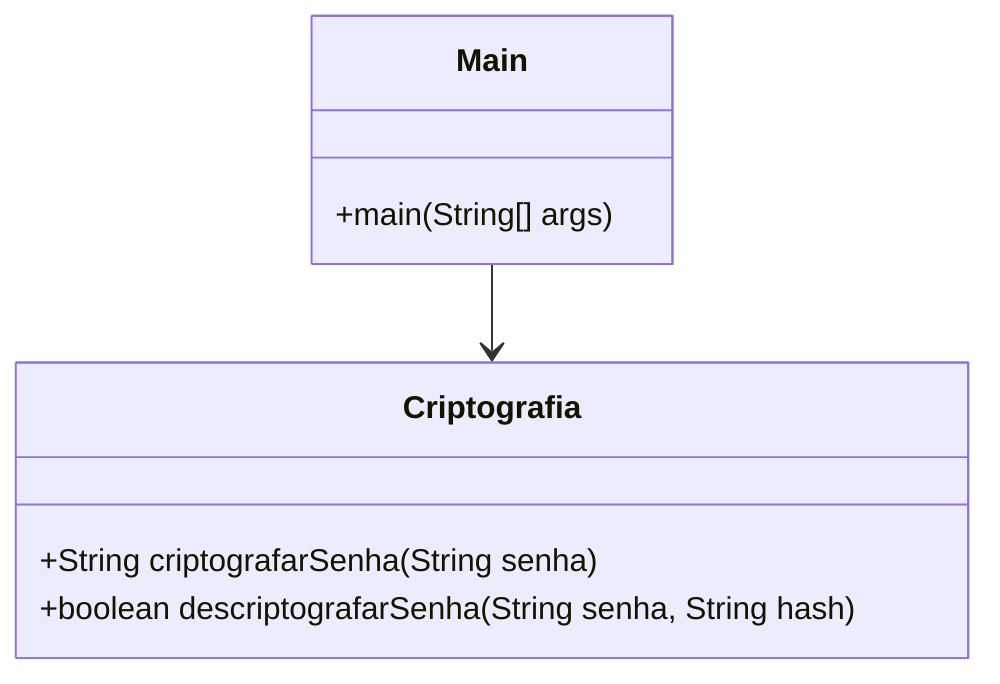

# Criptografar Senha

[](https://www.java.com)
[](https://maven.apache.org/)
[](https://github.com/jeremyh/jBCrypt)

## Visão Geral

O projeto Criptografar Senha é uma aplicação de console desenvolvida em Java que demonstra a utilização da biblioteca jBCrypt para hashing e verificação de senhas. O objetivo principal é ilustrar como armazenar senhas de forma segura, evitando o armazenamento em texto puro, e como validar senhas fornecidas pelo usuário contra os hashes armazenados.

## Arquitetura e Design de Software

O projeto é simples e focado em uma única funcionalidade, com uma estrutura de pacotes minimalista para demonstrar a separação de responsabilidades.

### Estrutura de Pacotes

| Pacote | Responsabilidade |
| :--- | :--- |
| `br.com` | Pacote raiz que contém a classe `Main`, o ponto de entrada da aplicação, e a classe `Criptografia`, que encapsula a lógica de hashing e verificação de senhas. |

### Diagrama de Classes (Mermaid)



## Funcionalidades Principais

*   **Geração de Hash de Senha:** Utiliza o algoritmo bcrypt para criar um hash seguro de uma senha fornecida.
*   **Verificação de Senha:** Compara uma senha fornecida com um hash existente para verificar sua autenticidade.
*   **Interação via CLI:** Permite ao usuário interagir com o sistema através da linha de comando para testar a criptografia e verificação.

## Tecnologias e Dependências

*   **Java 17+:** Linguagem de programação principal.
*   **Maven:** Ferramenta de automação de compilação e gerenciamento de dependências.
*   **jBCrypt:** Biblioteca para hashing de senhas, fornecendo uma implementação robusta do algoritmo bcrypt.

## Instalação e Execução

1.  **Pré-requisitos:**
    *   Java 17 ou superior instalado.
    *   Maven instalado.

2.  **Clone o repositório:**

    ```bash
    git clone https://github.com/GilvanPedro/CriptografarSenha.git
    ```

3.  **Navegue até o diretório do projeto:**

    ```bash
    cd CriptografarSenha/CriptografarSenha
    ```

4.  **Compile e execute o projeto com Maven:**

    ```bash
    mvn compile exec:java -Dexec.mainClass="br.com.Main"
    ```

## Exemplo de Interação (CLI)

```bash
====== Criptografia de Senha ======
Senha criptografada: $2a$10$..................................................

Advinhe a Senha ==============
Digite sua senha: minhaSenhaSecreta
Senha correta!
```

## Licença

Este projeto está sob a Licença MIT.

## Autor

Este projeto foi desenvolvido por [Gilvan Pedro](https://github.com/GilvanPedro).
